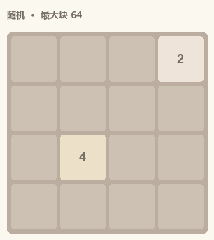
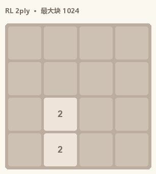
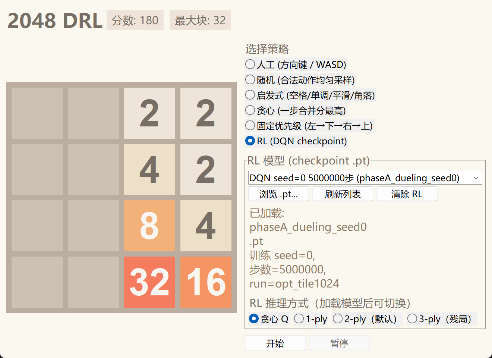

<div align="center">

# RL-2048

可视化、可训练的强化学习 2048

Dueling DQN 学局面价值，2-ply expectimax 收残局；同一套规则和固定种子，把 RL 与随机 / 启发式 / 贪心对照。发布权重 val 200 上 **P(2048) = 93.5%**。

<p>



</p>

<sub>从左到右：随机 · 启发式 · Phase A DQN + 2-ply expectimax</sub>

</div>

## 结果

同一套标准 2048 规则（到达 2048 **不结束**）。主指标 **P(2048)**。

| 方法 | 均分 | P(1024) | P(2048) | 协议 |
|------|-----:|--------:|--------:|------|
| 随机 | 1097 | 0% | 0% | val 1000 |
| 启发式 | ~3850 | 1.8% | 0% | val 1000 |
| Phase A（贪心 Q） | 6123 | 16.9% | 0.27% | val 1000 |
| Phase A + 1-ply | ~15820 | 82.6% | 26.4% | val 1000，play-out |
| **Phase A + 2-ply** | **20754** | **99.5%** | **93.5%** | seed0，val 200，stop@2048 |

发布权重：[checkpoints/phaseA_dueling_seed0.pt](checkpoints/README.md)（Dueling CNN，5M steps）。默认推理是 **2-ply**；贪心 Q 明显弱于搜索，说明网络主要提供局面价值。均分在 stop@2048 与 play-out 之间不可比。更多数字与弯路见 [docs/updates.md](docs/updates.md)。

## 安装

Python 3.10+，依赖装在项目目录内。可视化需要 **tkinter**（Miniconda / 官方安装一般自带）。

**Windows**

```powershell
.\scripts\setup_env.ps1
.\.venv\Scripts\Activate.ps1
pip install -e ".[dev,viz]"
pytest
```

**Linux**

```bash
python3 -m venv --system-site-packages .venv
source .venv/bin/activate
pip install -e ".[dev,viz]"
pytest
```

训练再装 `pip install -e ".[dev,viz,train]"`。云 GPU 见 [docs/autodl.md](docs/autodl.md)。

## 使用

```powershell
rl2048-play
```

加载发布权重后默认 **2-ply**，右侧可切贪心 Q / 1-ply / 3-ply。基线策略无需 checkpoint。Space 开始/暂停，R 重置，N 单步，方向键/WASD 人工。

<p align="center">

</p>

```powershell
rl2048-eval                                 # 基线，dev 200
rl2048-eval --checkpoint checkpoints/phaseA_dueling_seed0.pt --episodes 200 --seed-set val
# 只量网络：加 --decode greedy --max-steps 1200
```

## 训练

```powershell
rl2048-train --config configs/autodl/opt_tile1024.yaml --train-seed 0
```

对应发布权重的栈：one-hot `C×4×4`、Dueling CNN、D4 增强、`n_step=5`、`gamma=0.995`、`log1p` 训练奖励。PER 默认关闭（见 [docs/per_notes.md](docs/per_notes.md)）。AutoDL 流程见 [docs/autodl.md](docs/autodl.md)。

重导 README 演示 GIF：`python scripts/export_readme_gifs.py`。

## 文档

- [docs/updates.md](docs/updates.md) — 算法栈、对照数字、走过的弯路
- [docs/autodl.md](docs/autodl.md) — AutoDL 云上训练
- [docs/per_notes.md](docs/per_notes.md) — 为何默认关掉 PER
- [checkpoints/README.md](checkpoints/README.md) — 发布权重
